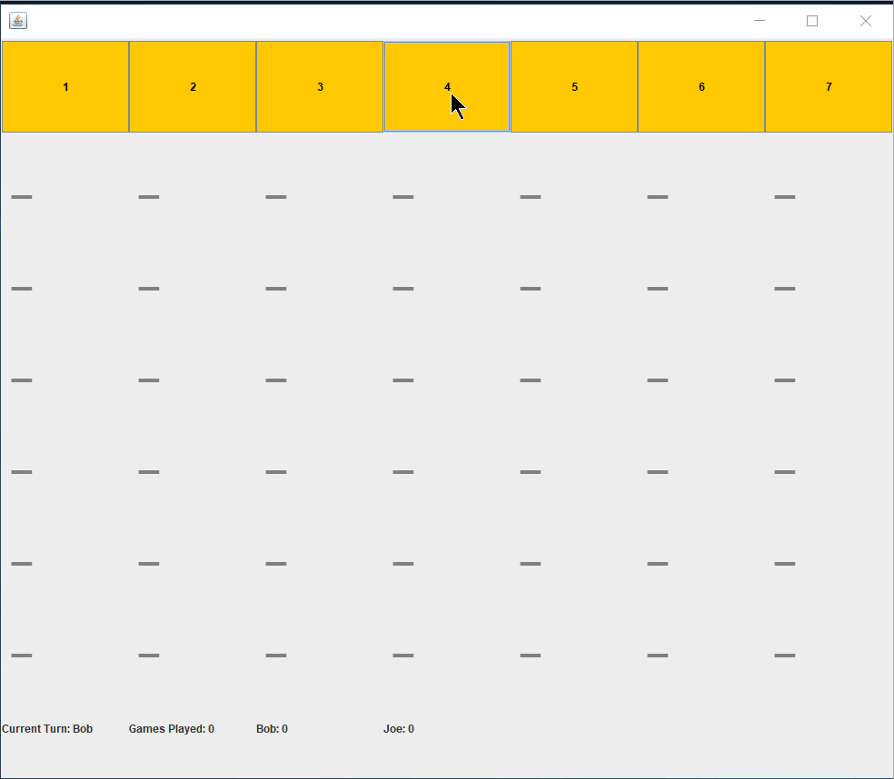

# ConnectFour

Allows two users to compete in Connect Four, one player represents X & the other player represents O.
One player must get 4 of their pieces to be consecutively in horizontal/vertical/diagonal orientation to win.
The users can continue playing, which will reset the board and keep playing many games.
There is a scoreboard that keeps track who's turn it is and the games won by each player.

